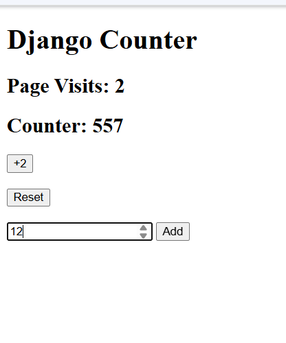

# Counter Assignment

## Description
This is a simple Django Counter App that uses **session** to store data.

The app can:
- Count page visits
- Increase the counter by 2
- Add a custom number
- Reset / destroy the session

## Preview



## Features
- Django project setup
- Session usage
- Routes / URLs
- Buttons and form submission
- Redirect after actions

## How to Run

```bash
python manage.py runserver
