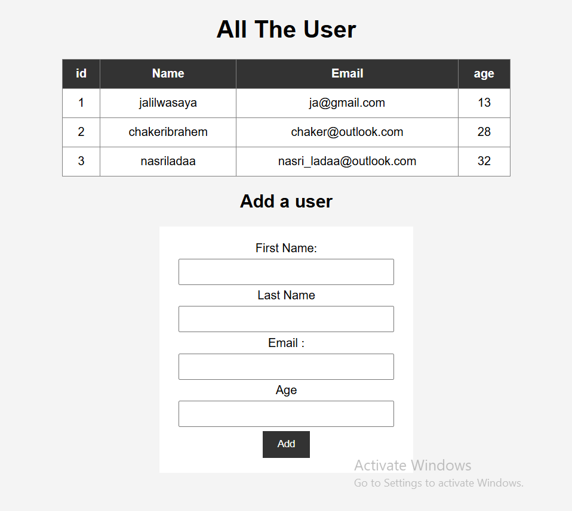

# Users With Templates

This project is a simple Django application that displays users from a database and allows adding new users using a form.

---

## Features

* Display all users in a table
* Add a new user using a form
* Save users to the database
* Simple and clean UI with basic CSS

---

## Technologies Used

* Python
* Django
* HTML
* CSS
* SQLite

---

## Project Structure

```text
User_With_Project/
│
├── User_With_Project/
│
├── UsersApp/
│   ├── migrations/
│   ├── static/
│   │   └── style.css
│   ├── templates/
│   │   └── index.html
│   ├── models.py
│   ├── views.py
│   └── urls.py
│
├── manage.py
```

---

## Installation

Clone the repository:

```bash
git clone <your-github-link>
```

Go to the project folder:

```bash
cd User_With_Project
```

Create virtual environment:

```bash
python -m venv djangoPy3Env
```

Activate virtual environment:

### Windows

```bash
djangoPy3Env\Scripts\activate
```

Install Django:

```bash
pip install django
```

Run migrations:

```bash
python manage.py makemigrations
python manage.py migrate
```

Start the server:

```bash
python manage.py runserver
```

Open in browser:

```text
http://127.0.0.1:8000
```

---

## Screenshot

Add your screenshot inside the project and name it:

```text
result.png
```

Then use:

```md

```

---

## Author

Jalil Wasaya
Chaker Ibrahem
