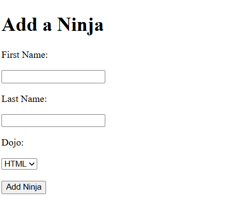
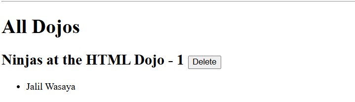

# Dojos and Ninjas

A Django application that demonstrates One-to-Many relationships using Dojos and Ninjas.

## Features

- Create a Dojo
- Create a Ninja
- Assign Ninjas to Dojos
- View all Dojos and their Ninjas
- Display the number of Ninjas in each Dojo
- Delete a Dojo and all associated Ninjas

---

## Technologies Used

- Python
- Django
- SQLite
- HTML

---

## Screenshots

### Add Dojo


### Add Ninja



### Result



---

## Models

### Dojo

```python
class Dojo(models.Model):
    name = models.CharField(max_length=255)
    city = models.CharField(max_length=255)
    state = models.CharField(max_length=2)
```

### Ninja

```python
class Ninja(models.Model):
    first_name = models.CharField(max_length=255)
    last_name = models.CharField(max_length=255)

    dojo = models.ForeignKey(
        Dojo,
        related_name="ninjas",
        on_delete=models.CASCADE
    )
```

---

## Concepts Learned

### ForeignKey

Creates a one-to-many relationship between Dojos and Ninjas.

### related_name

```python
related_name="ninjas"
```

Allows access to all ninjas that belong to a dojo:

```python
dojo.ninjas.all()
```

### CASCADE

```python
on_delete=models.CASCADE
```

When a dojo is deleted, all associated ninjas are automatically deleted.

---

## Author

**Jalil Iskander Wasaya**  
AXSOS Academy – Full Stack Developer Trainee