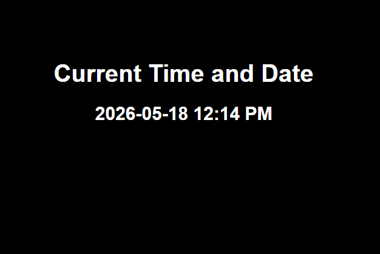

# Time Display - Django Project

## Overview
A simple Django application that displays the current date and time using templates, views, and static CSS files.

## Technologies
- Python
- Django
- HTML
- CSS

## Features
- Display current date and time
- Django routing
- Pass data using context
- Render HTML template
- Custom CSS styling

## Main Concepts Learned
- Django Project & App setup
- URL Routing
- Views
- Templates
- Static Files
- render() function
- Context Dictionary

## Django Flow
URL → View → Context → Template → Response

## Run Project
```cmd
py manage.py runserver
``` 
# Project Preview

