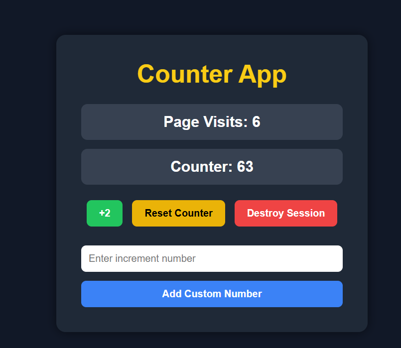

# Flask Counter Assignment

## Description
This is a Flask application that uses session to count how many times a user visits the website.  
It also includes buttons to increase, reset, and clear the counter.

## Features
- Count page visits
- Store data using Flask session
- Clear session using `/destroy_session`
- Add +2 button
- Reset counter button
- Custom increment form

## How to Run

```bash
python server.py

