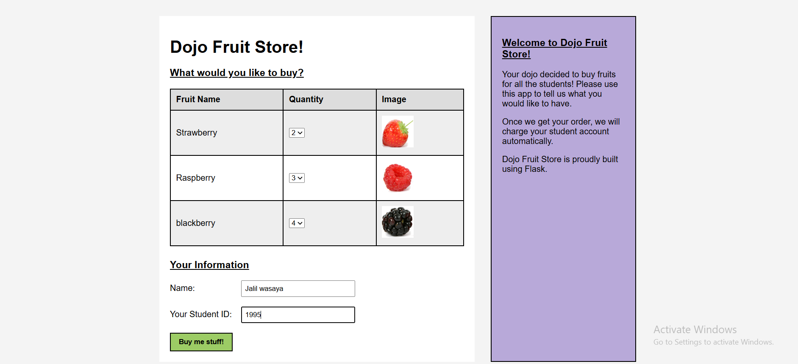
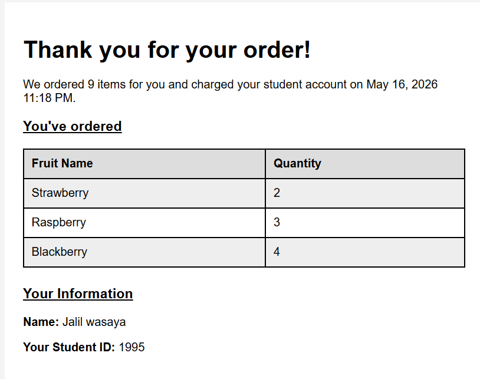

# Dojo Fruit Store

## Description
A simple Flask web application that allows users to order fruits online.

Users can:
- Select fruit quantities
- Enter their name and student ID
- Submit the order
- View the checkout summary page

This project practices:
- Flask routing
- POST requests
- Form handling
- Passing data to templates
- Using Jinja variables
- Static files (CSS & Images)

---

## Technologies Used

- Python
- Flask
- HTML
- CSS

---

## Project Structure

```bash
Dojo_Fruit_Store/
│
├── server.py
│
├── templates/
│   ├── fruits.html
│   └── checkout.html
│
├── static/
│   ├── style.css
│   └── img/
│       ├── strawberry.png
│       ├── raspberry.png
│       └── apple.png
```

---

## Features

- Fruit selection with quantities
- Form submission using POST
- Checkout page
- Order summary
- Terminal print statement
- Fruit images
- Styled pages using CSS

---

## How to Run

### 1. Install Flask

```bash
pip install flask
```

### 2. Run the server

```bash
py server.py
```

### 3. Open browser

```text
http://localhost:5000
```

---

## Learning Objectives

- Understand GET and POST requests
- Use request.form
- Convert strings to integers using int()
- Pass variables to HTML templates
- Use Jinja syntax
- Link static files in Flask

---

## Important Note

Refreshing the checkout page repeats the POST request.

The terminal will print:

```text
Charging Michael for 5 fruits.
```

again because the browser resubmits the form data.



