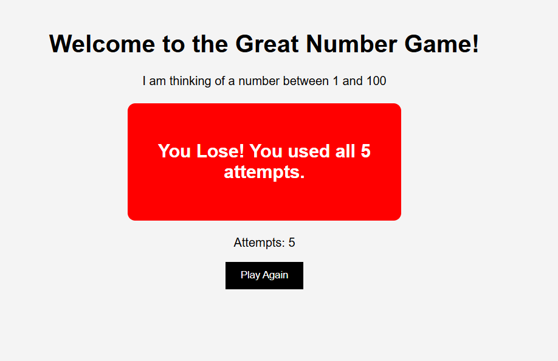

# Great Number Game

A fun Flask guessing game where the user tries to guess a random number between 1 and 100.

## Features

- Random number generation
- Store game data using Flask session
- Show if the guess is too high or too low
- Track number of attempts
- Maximum 5 attempts
- Win and lose messages
- Reset and play again

## Technologies Used

- Python
- Flask
- HTML
- CSS

## Project Structure

```bash
great_number_game/
│
├── server.py
├── templates/
│   └── index.html
└── static/
    └── style.css
```

## How to Run

```bash
python server.py
```

Open in browser:

```bash
http://localhost:5000
```

## Learning Objectives

- Practice Flask routing
- Practice sessions in Flask
- Handle form submissions
- Use conditionals in Jinja
- Build interactive web applications

