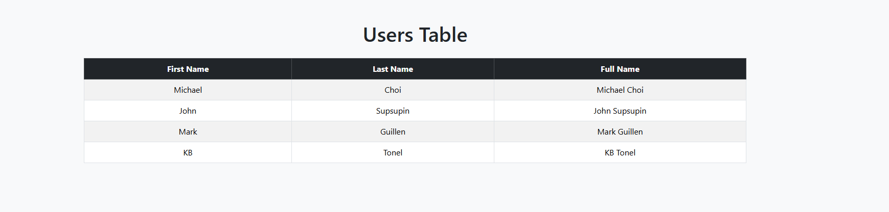

# HTML Table - Flask Assignment

## Description
This project is a simple Flask application that displays user information inside an HTML table using Jinja templating.

The application passes a list of dictionaries from the Flask route to the HTML template and dynamically renders the data in a styled Bootstrap table.

---

## Features
- Flask routing
- Passing data from backend to frontend
- Using Jinja for loops
- Displaying dictionaries in HTML
- Bootstrap table styling

---

## Technologies Used
- Python
- Flask
- HTML
- Bootstrap 5
- Jinja2

---

## Project Structure

html_table/
│
├── server.py
│
├── templates/
│   └── index.html
│
└── README.md

---

## How to Run

### 1. Activate virtual environment

```bash
source myenv/Scripts/activate

##  images
